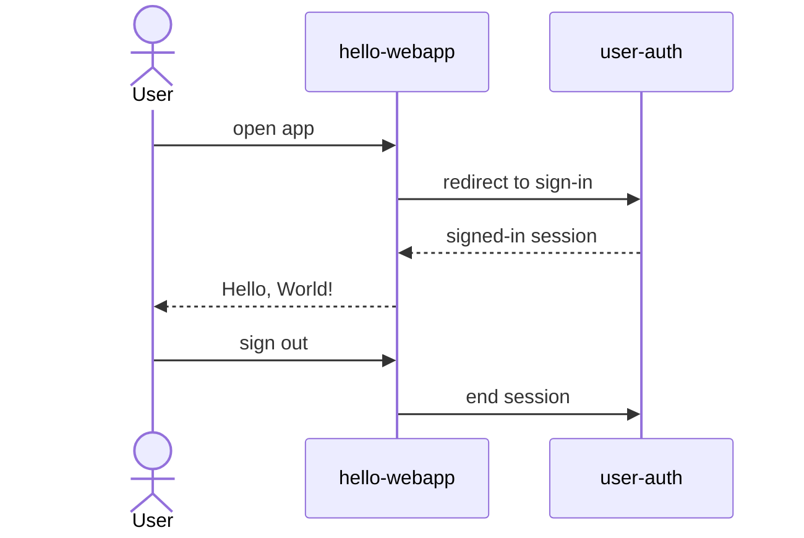

# Sign in and see the greeting

A User opens the app, signs in through SSO and sees "Hello, World!", then signs out.

```mermaid
sequenceDiagram
    actor User
    participant hello-webapp
    participant user-auth

    User->>hello-webapp: open app
    hello-webapp->>user-auth: redirect to sign-in
    user-auth-->>hello-webapp: signed-in session
    hello-webapp-->>User: Hello, World!
    User->>hello-webapp: sign out
    hello-webapp->>user-auth: end session
```